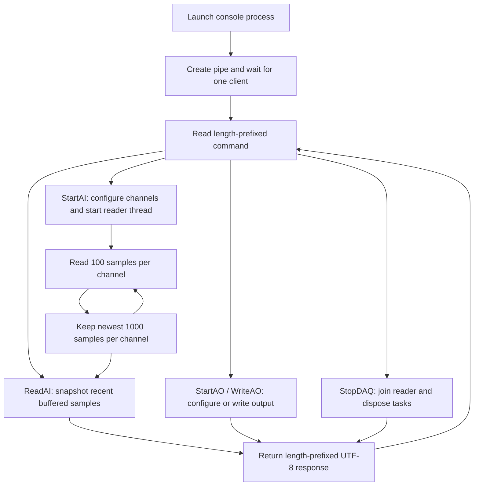

# QuantumDAQService

NI-DAQ analog-input monitoring and analog-output control for QuantaMeasure. This Windows console application exposes a command interface over the named pipe `\\.\pipe\QuantumDAQPipe` so the WPF UI can monitor voltages while an experiment runs.

This guide describes `v1.6-2cards-sync-skew`. Despite its name, the program is a console process, not an installed Windows Service. GaGe acquisition, calibration, and CUDA correlations belong to the separate [GageStreamThruGPU backend](../GageStreamThruGPU/README.md).

[Project overview](../README.md) · [UI guide](../Quantum%20Measurement%20UI/README.md) · [Service source](QuantumDAQService.cs) · [UI pipe client](../Quantum%20Measurement%20UI/PipeClient.cs)

## Responsibilities

- Configure differential analog-input channels on an NI-DAQ device.
- Read samples in a background thread and retain a rolling window per channel.
- Return recent voltage samples when the UI requests them.
- Initialize an analog-output channel and write a single voltage on request.
- Dispose acquisition/output tasks when commanded or when the connection scope ends normally.

The service itself writes no experiment files and performs no GaGe synchronization or GPU analysis. The UI handles display and experiment-level interpretation of these voltage readings.

## Requirements and build

| Dependency | Checked-in configuration |
| --- | --- |
| Platform | Windows; Windows named pipes and NI-DAQmx |
| Framework | .NET Framework 4.5, not the UI's .NET 8 target |
| Build tools | MSBuild/C# tools with the required .NET Framework reference assemblies |
| Vendor library | `NationalInstruments.DAQmx.dll` and compatible NI-DAQmx runtime/driver |
| Hardware | NI device supporting the requested differential AI channels and, if used, AO channel |

Open [QuantumDAQService.csproj](QuantumDAQService.csproj) in a compatible Visual Studio/MSBuild environment. Resolve its NI-DAQmx reference to your installation before building. The checked-in reference includes an installation-specific relative path, an `x86` assembly identity, and an `Assemblies (64-bit)` hint path; verify the actual assembly and process architecture together.

From a Developer PowerShell at the repository root:

```powershell
msbuild .\QuantumDAQService\QuantumDAQService.csproj /p:Configuration=Debug /p:Platform=AnyCPU
.\QuantumDAQService\bin\Debug\QuantumDAQService.exe
```

The project targets an older framework. A missing-reference-assemblies error requires a build environment supporting that target, or an intentional framework retargeting with NI library compatibility checked. Installing only the UI's .NET 8 SDK is not sufficient.

## Configure and connect

1. Confirm the NI device name and physical channels in your NI configuration tools. `DaqController.DeviceName` defaults to `Dev1`; changing the device name currently requires a source change.
2. Check differential wiring and the channels supported by the device. The source configures both AI and AO voltage ranges as -10 to +10 V.
3. Build and launch the service. `Waiting for client connection...` is its normal idle state.
4. Connect through the UI's DAQ connection flow. The UI can launch the service automatically, but its hard-coded executable path in [Configuration_Process_and_Closing.cs](../Quantum%20Measurement%20UI/Window_Logic/Configuration_Process_and_Closing.cs) must match your installation.
5. The UI sends `StartAI ai0,ai1,ai2,ai3,ai4,ai5`, using the default sample rate of 10,000 samples/s per channel. It requests `ReadAI 150` for updates; its configured UI refresh interval is 100 ms.

Channel names in commands are relative names such as `ai0` or `ao0`. The service adds `Dev1/`; do not pass `Dev1/ai0` as the channel argument.

[App.config](App.config) declares the runtime target only. It does not configure device names, channels, or sampling parameters. Those are set by the source and pipe commands.

## Service workflow



The command loop and background AI reader have separate responsibilities:

1. The server accepts one client connection and creates a `DaqController` for that connection.
2. `StartAI` creates voltage channels in the requested order, selects differential inputs, and configures a continuous sample clock. It requests a DAQ buffer size numerically equal to the sample rate.
3. The reader thread calls `ReadMultiSample(100)`, appends samples under a buffer lock, trims each channel to its newest 1,000 samples, logs a preview, and sleeps for 10 ms after a successful iteration.
4. `ReadAI` takes a locked snapshot of the most recent available samples and serializes them. Reading does not remove samples from the buffers.
5. `StopDAQ` stops the reader loop, joins its thread, and disposes AI/AO tasks while leaving the command connection open. `Exit` terminates the process without a response.
6. A normal disconnect leaves the connection scope, disposes the controller, and returns to waiting for another client. Unhandled pipe I/O failures may instead terminate the process.

## Command reference

Commands are case-sensitive UTF-8 text inside the framing described below. Use single spaces between arguments and no spaces inside a comma-separated channel list.

| Command | Behavior | Response text |
| --- | --- | --- |
| `StartAI ai0,ai1 [rate]` | Initialize AI and start background reading; default rate is 10000 samples/s/channel | `Analog Input Initialized` |
| `ReadAI [count]` | Return latest available samples; default count 150, integer requests clamped to 1–1000 | Comma-separated voltage values |
| `StartAO ao0` | Initialize one analog-output channel | `Analog Output Initialized` |
| `WriteAO <voltage>` | Write one voltage; requires `StartAO` first | `Analog Output Written` |
| `StopDAQ` | Stop reader and dispose AI/AO tasks | `DAQ Tasks Disposed` |
| `Exit` | Terminate the service | No response |
| Unrecognized command | Reject command name | `Unknown Command` |

Responses normally end in a newline. Exceptions caught during command execution return `Error: <message>`. An invalid `ReadAI` integer falls back to 150. AI startup acknowledges initialization/thread launch, not the arrival of the first samples; an early `ReadAI` can return only a newline.

### Pipe framing

Both commands and responses use:

```text
[4-byte little-endian Int32: UTF-8 payload byte count][UTF-8 payload]
```

The server accepts command lengths from 1 to 4096 bytes. The prefix measures bytes, not characters, and response newlines are part of the payload. A plain line of text sent without the prefix is not a valid request.

The pipe uses message mode. Follow the existing client's two-write sequence: write the four-byte prefix, then write the payload. Serialize each full request/response exchange; the UI uses a semaphore for this. Read exactly the advertised response length. Do not wait for an acknowledgement after `Exit`, since none is sent.

See [PipeClient.cs](../Quantum%20Measurement%20UI/PipeClient.cs) for the current framing and exact-read implementation.

## Sample layout and timing

`ReadAI` returns **sample-major interleaved** values in the same channel order supplied to `StartAI`:

```text
ai0[t0], ai1[t0], ..., ai5[t0], ai0[t1], ai1[t1], ..., ai5[t1], ...
```

For six channels and 150 available samples per channel, this is 900 comma-separated values. Values are volts, formatted with `G17` and invariant culture. The response has no channel labels, timestamps, sample counter, or rate metadata; the client must retain that information from its configuration.

The service returns up to the requested count, limited by the least-populated channel. The current UI assumes six channels, so changing the channel list requires corresponding UI parsing and plotting changes.

**This is a recent-data monitor, not a lossless streaming recorder.** Repeated polls can overlap, while slow polls can miss samples because old values are discarded. At the configured 10 kHz rate, a 1,000-sample window nominally represents 100 ms and a 150-sample snapshot represents 15 ms. These are sample-count/rate calculations, not guarantees of achieved reader throughput or hardware-to-UI latency.

The reader requests 100 samples and also sleeps for 10 ms each successful iteration. Hardware reads, console logging, locking, and scheduling add overhead; validate sustained performance before increasing the sample rate or treating the snapshots as a continuous timeline.

## Troubleshooting

| Symptom | Check |
| --- | --- |
| UI cannot connect | Service process is running, executable path is correct, and another client has not occupied the single pipe connection. The current UI client connection timeout is 1000 ms. |
| NI assembly not found or architecture error | NI-DAQmx installation, DLL reference path, framework target, and actual process/library bitness. |
| Device/channel error | `Dev1`, requested physical channels, differential support, and whether another task has reserved the hardware. |
| Empty response after startup | Wait for the reader to collect samples, then request again. Inspect the service console for reader errors. |
| `ReadAI` returns an error | Initialize AI first; check reader state and command arguments. |
| Short response | Fewer samples may have accumulated than requested. Parse the received count rather than assuming a full snapshot. |
| `WriteAO` fails | Initialize AO first and check the requested voltage against the device/task range. |
| Stop appears slow | `Dispose` waits for the reader thread; an outstanding DAQ read must return before the join completes. |

## Notes for future implementation

- Add explicit initialized/running/stopped states. Repeated `StartAI` or `StartAO` currently replaces fields without first cleaning up the previous task; treat each connection as one acquisition session and reconnect for a fresh session.
- Use exact-length reads for the server's four-byte prefix, validate all argument counts, and define how malformed frames are rejected. The current prefix read assumes all four bytes arrive together.
- Parse rate and voltage arguments with invariant culture, matching output formatting. They currently use the process culture.
- Propagate reader failures to clients. Currently reader exceptions are printed to the console and the loop continues, so snapshots can be stale without an explicit error status.
- Add sample counters/timestamps and define whether reads consume data if continuous capture is required. A rolling snapshot alone cannot establish acquisition continuity or synchronization with GaGe data.
- Consider a bounded ring buffer, reduced console logging, and a measured read cadence. The current list trimming and fixed sleep should not be assumed to scale to higher rates.
- Make cancellation and disposal bounded and repeatable, and handle broken pipes around the connection lifecycle. `StopDAQ` does not clear all object fields, and cleanup currently joins the reader without an explicit timeout.

## Verification

This README was checked against the service, project file, and UI client. No NI hardware acquisition was performed for this documentation update.

For a hardware check, connect a client, start AI on confirmed channels, allow samples to accumulate, request a snapshot, verify channel order and voltages against known inputs, then send `StopDAQ` and disconnect. Test AO separately only when required by the experiment. The repository's GaGe pipe tests exercise a different protocol and do not validate this service.
