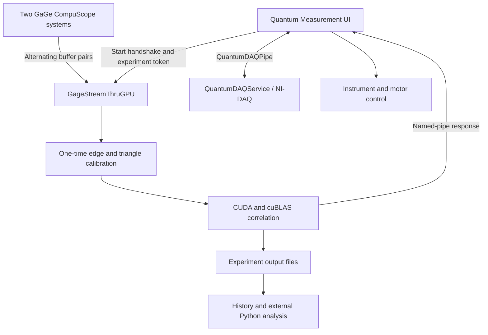

# QuantaMeasure — Quantum Measurement Software

Windows software for acquiring quantum measurement signals, displaying live correlations, coordinating laboratory instruments, and reviewing experiment results. The WPF frontend communicates with a two-board GaGe/CUDA acquisition backend and a separate NI-DAQ monitoring service.

**Branch: `v1.6-2cards-sync-skew`.** Start with the folder guide below; implementation details live beside the relevant code.

## Quick navigation

| Folder | Purpose | Start here |
| --- | --- | --- |
| [Quantum Measurement UI](Quantum%20Measurement%20UI/) | WPF frontend, live plots, experiment control, metadata, and history | [UI guide](Quantum%20Measurement%20UI/README.md) · [Window logic](Quantum%20Measurement%20UI/Window_Logic/Info.md) |
| [GageStreamThruGPU](GageStreamThruGPU/) | Main two-board acquisition and CUDA correlation backend | [Setup and usage](GageStreamThruGPU/README.md) · [Calibration equations](GageStreamThruGPU/README.md#implementation-reference-calibration-equations) |
| [GageStreamThruGPUAlignment](GageStreamThruGPUAlignment/) | Separate alignment backend project | [Acquisition source](GageStreamThruGPUAlignment/StreamThruGPU_Simple.c) · [Build project](GageStreamThruGPUAlignment/GageStreamThruGPU-Alignment.vcxproj) |
| [QuantumDAQService](QuantumDAQService/) | NI-DAQ analog-input monitoring over a separate named pipe | [Service source](QuantumDAQService/QuantumDAQService.cs) |
| [DataFiles Browser](DataFiles%20Browser/) | Launcher for the external Python experiment browser | [Launcher](DataFiles%20Browser/datafiles_browser.py) · [External dependency](#experiment-results-and-offline-analysis) |
| [StandaloneTcpIpDeviceController](StandaloneTcpIpDeviceController/) | Python GUI/CLI for Levante IR OPO TCP/IP control | [Controller guide](StandaloneTcpIpDeviceController/README.md) |
| [GageStreamThruGPU.Tests](GageStreamThruGPU.Tests/) | Named-pipe protocol tests without acquisition hardware or CUDA | [Build and run](GageStreamThruGPU.Tests/README.md) |
| [GageStreamThruGPU.WorkflowDemo](GageStreamThruGPU.WorkflowDemo/) | Synthetic two-board input through the CUDA cross-correlation path; requires a CUDA GPU | [Demo guide](GageStreamThruGPU.WorkflowDemo/README.md) |
| [GageStreamThruGPU.HardwareSmoke](GageStreamThruGPU.HardwareSmoke/) | Minimal client that launches and exercises the real acquisition backend | [Hardware check](GageStreamThruGPU.HardwareSmoke/README.md) |
| [Images](Images/) | Interface demo, diagrams, and reference figures | [Interface demo](Images/QM-software.gif) |
| [.vscode](.vscode/) | Checked-in editor configuration | [Browse settings](.vscode/) |

[Build and setup](#build-and-setup) · [Experiment workflow](#experiment-workflow) · [Current changes](#current-branch-changes) · [Known limitations](#known-limitations) · [Validation](#validation)


## Current branch changes

- **Two-board acquisition and alignment:** the main backend pairs the corresponding board buffers in both ping-pong branches and applies software sample offsets before GPU analysis. The backend guide now documents loop timing, calibration equations, and requirements for future implementations.
- **Calibration and failure handling:** edge-threshold minimum/maximum tracking is restored; the current triangle lock selects the minimum. Missing calibration references terminate the run without an automatic relaunch.
- **Experiment files:** the backend creates the experiment directory before opening its result files. The parent output directory still needs to exist.
- **Live UI:** matrix accumulation uses all received frames by default, and live OxyPlot axes are locked against pan/zoom.
- **Experiment history:** shortcuts open the running-mean evaluation, diagonal-offset map, FFT image, and combined raw-standard-deviation plot for the selected run.
- **Focused validation tools:** separate protocol tests, a synthetic CUDA workflow demo, and a real-hardware smoke client help check different parts of the system.

**G2 autocorrelation is not yet optimized. In the current experimental setup, processing takes longer than the buffer-transfer interval and cannot finish within the next buffer's transfer duration.** It should not be treated as a sustained real-time acquisition path. See the [G2 throughput limitation](GageStreamThruGPU/README.md#current-limitation-g2-autocorrelation-throughput).

## Experiment workflow



1. **Prepare the run.** Configure device paths, hardware settings, output locations, and experiment metadata in the UI workflow.
2. **Connect the backend.** The acquisition process waits on `\\.\pipe\DataPipe` for a client and a start handshake containing a 15-byte experiment token. Launching the executable alone does not begin acquisition, even with `UseIPC=0`.
3. **Initialize and stream.** The backend loads `StreamThruGPU.ini` from its working directory, initializes both digitizers, and allocates two buffers per board. It starts transfers into one pair while working on the previous completed pair.
4. **Calibrate once.** Rising edges on board 1 channel 2 and board 2 channel 1 establish relative skew. The minimum of the eight-frame triangle on board 1 channel 1 is aligned to the fourth frame in the GPU view. These offsets are reused for subsequent buffers.
5. **Analyze and display.** CUDA/cuBLAS computes the selected correlation output. The UI requests live data and updates its plots; the separate DAQ service supports analog monitoring.
6. **Save and review.** Results are written into the experiment directory. The UI history opens available analysis images; external Python tools provide additional review and post-processing.

For the buffer warm-up sequence, pointer pairing, offset equations, and future implementation checks, read the [backend acquisition-loop reference](GageStreamThruGPU/README.md#implementation-reference-acquisition-loop) and [calibration reference](GageStreamThruGPU/README.md#implementation-reference-calibration-equations).

## Build and setup

The repository contains several projects with different dependencies. Choose the component you need rather than assuming every project can run on a computer without laboratory hardware.

| Component | Main dependencies |
| --- | --- |
| WPF UI | Windows, .NET 8 SDK, NuGet packages, and referenced instrument/NI libraries |
| Main acquisition backend | Visual Studio 2022 C++ tools (`v143`), Windows SDK, CUDA 12.3, cuBLAS, GaGe C SDK and drivers, two supported CompuScope systems |
| NI-DAQ service | NI-DAQmx and the .NET/vendor references in its project file |
| Synthetic CUDA demo | C++/CUDA build tools and a compatible NVIDIA GPU; no GaGe digitizer required |
| Standalone TCP/IP controller | Python with Tkinter for the GUI and network access to the target device |
| Data browser | External post-processing implementation and its Python dependencies |

Clone this branch:

```powershell
git clone --branch v1.6-2cards-sync-skew https://github.com/Shung-An/Quantum-Measurement-Software.git
cd Quantum-Measurement-Software
```

Open [Quantum Measurement.sln](Quantum%20Measurement.sln) in Visual Studio. Follow the [backend build guide](GageStreamThruGPU/README.md#requirements-and-build) for SDK paths and CUDA integration. The UI can be built from the repository root with:

```powershell
dotnet build ".\Quantum Measurement UI\Quantum Measurement UI.csproj"
```

Before running an experiment:

- Adjust installation-specific executable paths in [Constants_Fields.cs](Quantum%20Measurement%20UI/Window_Logic/Constants_Fields.cs) and vendor DLL references in the project files.
- Supply a hardware-appropriate `StreamThruGPU.ini` in the backend's **working directory**. No INI is tracked in this branch; defaults are not a validated lab configuration.
- Check the backend's output base directory, currently `D:\Quantum Squeezing Project\DataFiles\`, and ensure its parent exists.
- Confirm calibration signal routing and use a new experiment directory for each run.

## Experiment results and offline analysis

The main backend writes `cm.bin`, `analysis.txt`, and, when profiling is enabled, `profile.txt`. Optional raw stream output follows the `DataFile` setting. Binary correlation data is appended while text logs are overwritten, so reusing a run directory can mix binary records from different runs. See [output formats](GageStreamThruGPU/README.md#outputs) before writing a reader.

The UI's Experiment History provides shortcuts for:

- `loglog_eval.png`
- `diagonal_offset_matrix_urad2.png`, falling back to `diagonal_offset_matrix_V2.png`
- `fft_result.png`
- `raw_std_over_time.png`

These files depend on which analysis steps were run; they are not all direct acquisition-backend outputs.

The [DataFiles Browser launcher](DataFiles%20Browser/datafiles_browser.py) loads an external implementation from a sibling directory:

```text
<parent of this repository>/prototype and postprocessing/post processing/datafiles_browser.py
```

That implementation is not included in this branch. Provide the expected external folder or adapt the launcher before using it; cloning this repository alone does not install the complete offline analysis pipeline.

## Known limitations

- **G2 throughput:** the current G2 autocorrelation implementation exceeds the transfer interval. Extra buffers do not resolve a sustained processing deficit. Profile computation, copying, and output writing before claiming real-time operation.
- **Calibration assumptions:** calibration is one-time, uses fixed channel assignments and an eight-frame triangle period, and aligns sample indices in software. It does not continuously correct hardware clock drift.
- **Matrix compatibility:** the pipe tests and smoke client use a 64-double matrix payload. Verify dimensions across GPU output, IPC, and readers when changing correlation mode or demodulation settings.
- **Machine-specific setup:** SDK includes, vendor DLL references, executable paths, output paths, and external analysis locations require local configuration.
- **Timing interpretation:** the backend's combined transfer-and-processing measurement is not an isolated DMA measurement. Use separate timing when assessing the available processing budget.

## Validation

| Goal | Entry point | What it establishes |
| --- | --- | --- |
| Check IPC behavior | [Protocol tests](GageStreamThruGPU.Tests/README.md) | Connection, requests, payload handling, and rejection cases |
| Exercise CUDA with synthetic input | [Workflow demo](GageStreamThruGPU.WorkflowDemo/README.md) | Runs the cross-correlation compute path without digitizers or UI |
| Exercise the actual backend | [Hardware smoke client](GageStreamThruGPU.HardwareSmoke/README.md) | Starts acquisition, requests data, and stops through the pipe |
| Validate synchronization and numerical results | [Calibration implementation guidance](GageStreamThruGPU/README.md#requirements-for-a-future-implementation) | Defines cases to check with synthetic inputs and known hardware signals |

Passing a protocol test or producing a demo matrix does not establish physical synchronization, G2 correctness, or sustained throughput. Validate those on the target acquisition setup.

## Development entry points

- **UI behavior:** [MainWindow.xaml](Quantum%20Measurement%20UI/MainWindow.xaml), [Data_Update.cs](Quantum%20Measurement%20UI/Window_Logic/Data_Update.cs), and [experiment lifecycle](Quantum%20Measurement%20UI/Window_Logic/Experiment_Motor_Control.cs).
- **Acquisition/calibration:** [StreamThruGPU_Simple.c](GageStreamThruGPU/StreamThruGPU_Simple.c).
- **GPU mathematics:** [DSPEquation_Simple_GPU.cu](GageStreamThruGPU/DSPEquation_Simple_GPU.cu) and [mathematical reference](GageStreamThruGPU/Correlation_Matrix_Computation_Math.pdf).
- **Process communication:** [backend pipe server](GageStreamThruGPU/pipe.cpp) and [UI pipe client](Quantum%20Measurement%20UI/PipeClient.cs).
- **DAQ monitoring:** [QuantumDAQService.cs](QuantumDAQService/QuantumDAQService.cs).

Preserve the source-level vendor copyright and usage notices when modifying or redistributing the acquisition code.
